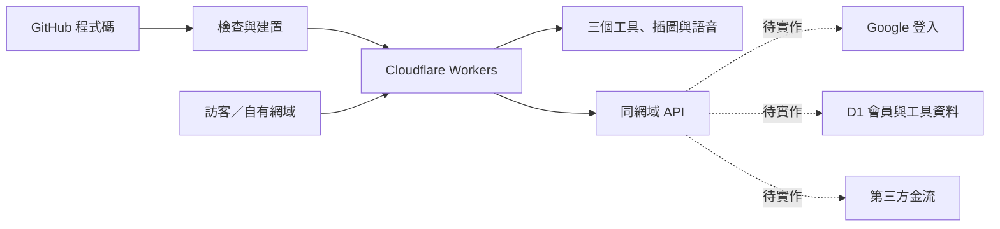

# 參照 What’Sub 的架構與主機部署

查核日期：2026-09-09。參考網站：<https://whatsub.equal2.app/>。

## 查到什麼

只讀取公開首頁、首頁正常載入的公開程式、HTTP 回應與 DNS；沒有登入對方帳號、呼叫寫入 API、探測隱藏服務或複製對方程式。

| 層次 | 公開證據 | 可確認的結論 |
| --- | --- | --- |
| DNS／流量入口 | equal2.app 的 NS 是 jasmine.ns.cloudflare.com、lars.ns.cloudflare.com；HTTP Server: cloudflare 與 CF-RAY | 使用 Cloudflare DNS／邊緣代理。這不能證明原站在 Workers、Pages 或哪家主機。 |
| 前端與後端 | 首頁 HTML、JS 與同網域 /api/auth、/api/contact 等 | 網站與 API 分層，同一網域提供服務。未確認後端語言或框架。 |
| 登入 | Google Identity Services；首頁條款有 Google 帳號說明 | 使用 Google 登入並由自己的後端處理帳號。 |
| 資料 | 官網與隱私政策描述跨裝置專案保存 | 有雲端專案資料；資料庫品牌未公開。 |
| 金流 | 公開程式使用 /api/newebpay?op=sales-status | 有藍新整合線索；不能據此斷言所有付款路徑均使用同一家。 |
| 工作分配 | 官網說影片留在本機，聲音送辨識 | 本機工作與雲端服務分開。日常工具所可保留操作在本機，再逐項加入需要的雲端資料。 |

第一手頁面：[首頁](https://whatsub.equal2.app/)、[服務條款](https://whatsub.equal2.app/#terms)、[隱私政策](https://whatsub.equal2.app/#privacy)。政策以首頁視窗顯示。

## 我們採用的對應架構

以下是本專案的選擇，**不是聲稱 What’Sub 使用這些主機或資料庫**。



- **這次已實作**：獨立 Workers 設定、根路徑網站輸出、後端入口與健康狀態 API、舊工具網址轉接、相容內嵌英文工具的回應標頭、GitHub 建置檢查。
- **尚未啟用**：Cloudflare 線上部署（Cloudflare 已登入，GitHub 要求本人再次驗證，完成後才能建立 Git 連動）、自有網域（尚未提供）、Google 登入、雲端資料庫、訂閱及收款。
- **既有網址**：Sites 與 GitHub Pages 維持可用；新主機驗證前不切換對外入口。

`GET /api/health` 回報主機程式版本及目前仍為本機資料，會員與付款均為 false。其餘未實作 API 回傳 JSON 404，不回傳假成功或首頁 HTML。現有工具不會因為準備新主機而改成上傳使用者資料。

## 登入後如何部署

建議用 Cloudflare 的 Git 整合，讓 GitHub 更新後自動發布，不必把部署密鑰放入程式碼。

1. 使用自己的帳號登入 <https://dash.cloudflare.com/>。
2. Workers & Pages → Create application → Import a repository。
3. GitHub 只授權所需的 `taiwanape/smallshop-pos-tw` repository；不需要給所有 repository 權限。
4. 使用以下設定：

| 設定 | 值 |
| --- | --- |
| Worker 名稱 | `daily-tools`（需與 wrangler.jsonc 一致） |
| Repository 根目錄 | `/` |
| Production branch | `main` |
| Build command | `pnpm test && pnpm typecheck && pnpm build:cloudflare` |
| Deploy command | `pnpm deploy:cloudflare` |
| Node.js | 22.13 以上；目前 CI 使用 22 |

第一次發布會取得 Cloudflare 分配的 workers.dev 網址，先確認它能開啟，再把完整 HTTPS 網址設為建置變數 `PUBLIC_SITE_URL`，重新建置。未設定時不猜測網域，分享連結留在目前主機、HTML 不輸出錯誤的 og:url。

若選用 CLI，登入後執行：

```sh
pnpm build:cloudflare
pnpm check:cloudflare
pnpm deploy:cloudflare
```

CLI 需要 `wrangler login`，與瀏覽器登入是兩個步驟。OAuth 及密鑰保存在工具／平台的安全設定中，不放入 GitHub、HTML 或前端 JS。尚未登入時本機建置、測試與 dry-run 仍能執行。

## 發布驗收

1. 公開訪客可開啟首頁與三個工具；保留 /classroom、/learn、/pos、/demo 舊連結。
2. /api/health 回傳 JSON、正確版本、no-store；不存在的 API 及 JS／音檔回傳 404。
3. Lexi 的 iframe、字型、圖片與 106 段語音均可載入；不要設定阻擋同源 iframe 的 DENY 或 frame-ancestors 'none'。
4. release.json 的 commit 必須對應實際發布來源；正式 HTTPS 驗證也會核對 release.url 與首頁 og:url，確認 PUBLIC_SITE_URL 設定正確。
5. 核對主機帳號、免費／付費方案狀態及網域後才更新 README、GitHub 簡介與公開分享入口。
6. 若從舊網址轉用新網址，先按[資料搬移說明](hosting-and-migration.md)匯出與匯入；新主機不會自動讀取舊網域的本機資料。

可執行 `node scripts/verify-cloudflare.mjs` 驗證本機 8787 主機；正式發布後，在命令後面加上實際 HTTPS 主機網址。驗證會檢查版本、API、8 個舊網址形式、圖片／程式／字型及 106 段語音，不會寫入使用者資料。

## 後續會員、資料與收款怎麼接

- Google 登入：後端驗證身分，建立自己的使用者 ID 與 HttpOnly session；每次讀寫資料都檢查使用者及所屬店家／班級。未建置完成前不顯示可用的登入或跨裝置同步。
- D1：作為這個版本的資料庫規劃，保存會員、工具空間與訂閱狀態；工具資料需版本控制、權限隔離及可還原備份。沒有因本文件而建立資料庫或套用任何 schema。
- 金流：可評估藍新，需先有自己的商店帳號與正式核准的服務。付款頁交金流商；後端核實通知、處理重複事件、到期與取消，再更新權限。沒有商店設定時不得把按鈕做成「付款成功」。
- 原五結菜單、班級養成與英文閱讀繼續使用各自的資料模型；這是主機與服務架構調整，不是重寫成字幕工具。

官方部署參考：[Workers 靜態資源與 API](https://developers.cloudflare.com/workers/static-assets/)、[GitHub 連動發布](https://developers.cloudflare.com/workers/ci-cd/builds/)、[靜態資源回應標頭](https://developers.cloudflare.com/workers/static-assets/headers/)。
