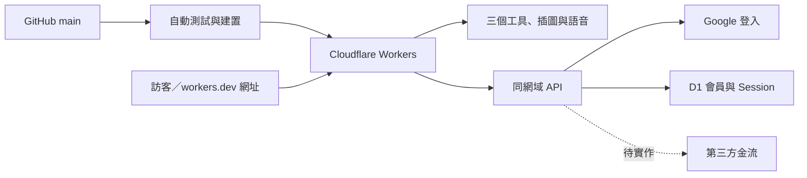

# 參照 What’Sub 的架構與主機部署

查核日期：2026-09-09。參考網站：<https://whatsub.equal2.app/>。

## 查到什麼

只讀取公開首頁、首頁正常載入的公開程式、HTTP 回應與 DNS；沒有登入對方帳號、呼叫寫入 API、探測隱藏服務或複製對方程式。

| 層次          | 公開證據                                                                                                 | 可確認的結論                                                                   |
| ------------- | -------------------------------------------------------------------------------------------------------- | ------------------------------------------------------------------------------ |
| DNS／流量入口 | equal2.app 的 NS 是 jasmine.ns.cloudflare.com、lars.ns.cloudflare.com；HTTP Server: cloudflare 與 CF-RAY | 使用 Cloudflare DNS／邊緣代理。這不能證明原站在 Workers、Pages 或哪家主機。    |
| 前端與後端    | 首頁 HTML、JS 與同網域 /api/auth、/api/contact 等                                                        | 網站與 API 分層，同一網域提供服務。未確認後端語言或框架。                      |
| 登入          | Google Identity Services；首頁條款有 Google 帳號說明                                                     | 使用 Google 登入並由自己的後端處理帳號。                                       |
| 資料          | 官網與隱私政策描述跨裝置專案保存                                                                         | 有雲端專案資料；資料庫品牌未公開。                                             |
| 金流          | 公開程式使用 /api/newebpay?op=sales-status                                                               | 有藍新整合線索；不能據此斷言所有付款路徑均使用同一家。                         |
| 工作分配      | 官網說影片留在本機，聲音送辨識                                                                           | 本機工作與雲端服務分開。日常工具所可保留操作在本機，再逐項加入需要的雲端資料。 |

第一手頁面：[首頁](https://whatsub.equal2.app/)、[服務條款](https://whatsub.equal2.app/#terms)、[隱私政策](https://whatsub.equal2.app/#privacy)。政策以首頁視窗顯示。

## 我們採用的對應架構

以下是本專案的選擇，**不是聲稱 What’Sub 使用這些主機或資料庫**。



- **已上線**：Cloudflare Worker `daily-tools`，公開網址為 <https://daily-tools.taiwanape.workers.dev/>。網站與 API 使用同一個網域，GitHub `main` 已連動自動測試、建置及發布；保留舊工具網址轉接及相容內嵌英文工具的回應標頭。
- **主機方案**：使用目前帳號的 Workers 免費方案及既有 `workers.dev` 網址，未購買自有網域或付費方案。實際額度與用量以帳號及[官方定價](https://developers.cloudflare.com/workers/platform/pricing/)為準。
- **尚未實作**：工具資料跨裝置同步、訂閱及收款；尚未設定自有網域。Google 會員使用 GIS + D1，設定與啟用查核見 [會員說明](member-auth.md)。
- **舊資料入口**：[原 Sites](https://smallshop-pos-tw.taiwanape1.chatgpt.site/)及[原 GitHub Pages](https://taiwanape.github.io/smallshop-pos-tw/)維持可用，使用者先回原網址匯出，再到新站手動匯入。

`GET /api/health` 回報版本、工具資料 browser-local、accounts 是否已設定，以及 billing: false。會員 API 位於 /api/auth/；其他未知 API 回傳 JSON 404。工具資料不因登入而上傳。

## 現行部署與管理

Cloudflare 的 Git 整合已連接 `taiwanape/smallshop-pos-tw`。推送 GitHub `main` 後，Cloudflare 自動執行測試、型別檢查與網站建置，成功後發布 Worker，不必手動上傳網站檔案。部署授權由平台管理，不放入程式碼。

管理時登入 [Cloudflare Dashboard](https://dash.cloudflare.com/)，在 Workers & Pages 開啟 `daily-tools`，查看建置／發布紀錄、設定與用量。既有 Worker 已建立，日常更新不需要再次匯入 repository。設定如下：

| 設定                       | 值                                                     |
| -------------------------- | ------------------------------------------------------ |
| Worker 名稱                | `daily-tools`（需與 wrangler.jsonc 一致）              |
| Repository 根目錄          | `/`                                                    |
| Production branch          | `main`                                                 |
| Build command              | `pnpm test && pnpm typecheck && pnpm build:cloudflare` |
| Deploy command             | `pnpm deploy:cloudflare`                               |
| Node.js                    | 22.13 以上；目前 CI 使用 22                            |
| 建置變數 `PUBLIC_SITE_URL` | `https://daily-tools.taiwanape.workers.dev/`           |
| 公開網址                   | `https://daily-tools.taiwanape.workers.dev/`           |

`PUBLIC_SITE_URL` 是建置變數，供首頁分享連結、`og:url` 及 `release.json` 使用，不是 Worker runtime variable。變更它後需重新建置及發布。未設定時，Cloudflare 產物保留目前主機的相對分享入口並省略 `og:url`；正式驗證則要求完整網址與實際主機一致。

GitHub Actions 另做測試、型別檢查、三個部署目標的建置檢查與 Wrangler dry-run，原 GitHub Pages 仍自動部署。Cloudflare 正式發布由 Cloudflare 的 Git 整合處理；GitHub CI 顯示成功後，仍需確認 Cloudflare 的發布結果。原 Sites 不會隨 GitHub 推送自動更新。

一般更新走上述 Git 整合。若改用 CLI，需先以 `wrangler login` 取得該帳號的 CLI 授權，並在本機環境明確設定 `PUBLIC_SITE_URL` 為正式網址；程式不會自行讀取 `.env` 的這個變數。之後執行：

```sh
pnpm build:cloudflare
pnpm check:cloudflare
pnpm deploy:cloudflare
```

瀏覽器登入不會自動授權本機 CLI。OAuth 及密鑰保存在工具／平台的安全設定中，不放入 GitHub、HTML 或前端 JS。本機建置、測試與 dry-run 不需要部署授權。

## 發布驗收

1. 公開訪客可開啟首頁與三個工具；保留 /classroom、/learn、/pos、/demo 舊連結。
2. /api/health 回傳 JSON、正確版本、no-store；不存在的 API 及 JS／音檔回傳 404。
3. Lexi 的 iframe、字型、圖片與 106 段語音均可載入；不要設定阻擋同源 iframe 的 DENY 或 frame-ancestors 'none'。
4. release.json 的 commit 必須對應實際發布來源；正式 HTTPS 驗證也會核對 release.url 與首頁 og:url，確認 PUBLIC_SITE_URL 設定正確。
5. 確認 GitHub `main` 的 commit 與 Cloudflare 發布版本相同；README、GitHub 簡介與公開分享入口使用正式 Cloudflare 網址，舊 Sites／Pages 匯出連結繼續保留。
6. 原 Sites 與 GitHub Pages 只轉址至 Cloudflare，不再運行舊工具介面。

從相同 commit 建置本機 `dist-cloudflare` 後，執行 `node scripts/verify-cloudflare.mjs https://daily-tools.taiwanape.workers.dev/` 驗證正式部署。不帶網址參數時驗證本機 8787 主機。腳本會檢查版本、分享網址、API、8 個舊網址形式、圖片／程式／字型及 106 段語音資源，不會寫入使用者資料；資源 HEAD 檢查通過不等於已驗證瀏覽器互動與實際播放。

## 後續會員、資料與收款怎麼接

- Google 登入已實作：後端驗證 Google token，以 sub 建立會員；必要 Cookie 維持登入。詳見 [會員說明](member-auth.md)。
- D1 保存會員與 session。工具空間、資料同步及訂閱狀態尚未加入；若擴充，需權限隔離與可還原備份。
- 金流：可評估藍新，需先有自己的商店帳號與正式核准的服務。付款頁交金流商；後端核實通知、處理重複事件、到期與取消，再更新權限。沒有商店設定時不得把按鈕做成「付款成功」。
- 原五結菜單、班級養成與英文閱讀繼續使用各自的資料模型；這是主機與服務架構調整，不是重寫成字幕工具。

官方部署參考：[Workers 靜態資源與 API](https://developers.cloudflare.com/workers/static-assets/)、[GitHub 連動發布](https://developers.cloudflare.com/workers/ci-cd/builds/)、[靜態資源回應標頭](https://developers.cloudflare.com/workers/static-assets/headers/)。
